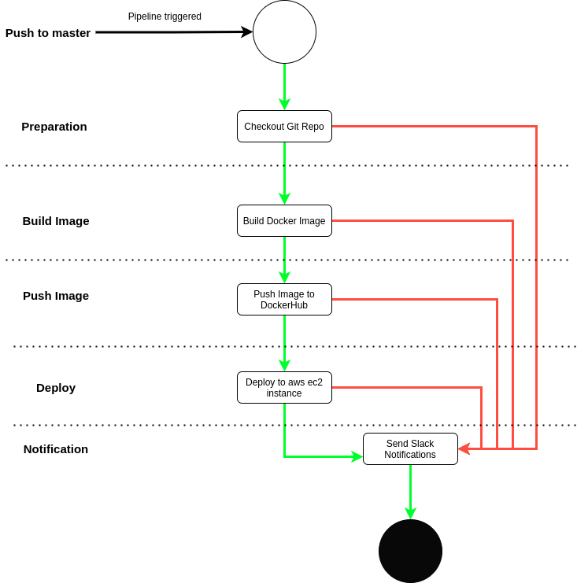

# Booster CI - CD Deployment Documentation

# [Live Link](http://13.59.226.101/)

# [GITHUB LINK](https://github.com/a7medayman6/Booster_CI_CD_Project)

# Pipeline



Pipeline Flowchart

- When the Jenkins pipeline gets triggered several stages starts sequentially

## 1. Preparation Stage

- Checks out the git repository on the runner

```bash
git checkout ${env.GIT_BRANCH}
```

## 2. Build Image

- Build the docker image from the existing Dockerfile in the repository

```bash
docker build -f Dockerfile -t a7medayman6/boosterapp 
```

## 3. Push Image

- Push the build docker image from to DockerHub with the creds in Jenkins credentials

```bash
withCredentials([usernamePassword(credentialsId:"Dockerhub", usernameVariable: 'USERNAME', passwordVariable: 'PASSWORD')])
{
    sh 'docker login --username $USERNAME --password $PASSWORD'
    sh 'docker push a7medayman6/boosterapp'
}
```

## 4. Deploy

- Deploy the application to the AWS EC2 instance which is acting as a Jenkins slave node using docker-compose

```bash
docker-compose up -d
```

## 5. POST STAGES : Notification

- Send Slack notifications in cases of success or failure.

```bash
success
{
    slackSend (color: '00FF00', message: "THE DEPLOYMENT SUCCEEDED.")
}
failure
{
    slackSend (color: '#FF0000', message: "THE DEPLOYMENT FAILED.")
}
```

# Jenkins file

```bash
pipeline
{
    agent { label 'aws-slave-1' }
    stages
    {
        stage('Prep')
        {
            steps
            {
                sh "git checkout ${env.GIT_BRANCH}"
            }
        }
    
        stage('Build Docker Image')
        {
            steps
            {
                sh 'docker build -f Dockerfile -t a7medayman6/boosterapp .'
            }
        }
        
        stage('Push Docker Image to Dockerhub')
        {
            steps
            {
                withCredentials([usernamePassword(credentialsId:"Dockerhub", usernameVariable: 'USERNAME', passwordVariable: 'PASSWORD')])
                {
                    sh 'docker login --username $USERNAME --password $PASSWORD'
                    sh 'docker push a7medayman6/boosterapp'
                }
            }
        }
        
        stage('Deploy')
        {
            steps
            {
                sh 'docker-compose up -d'
            }
        }
    }
    post
    {
        success
        {
            slackSend (color: '00FF00', message: "THE DEPLOYMENT SUCCEEDED.")
        }
        failure
        {
            slackSend (color: '#FF0000', message: "THE DEPLOYMENT FAILED.")
        }
    }
}
```

**The pipeline runs on an EC2 Jenkins slave instance which is configured with git and docker and docker-compose installed.** 

**The Jenkins master (dashboard) also runs on AWS EC2 Instance.**

# Containerization

- The Django app is containerized in a Docker image, here is the Dockerfile contents with comments.

```docker
# build the image based on python:3.8-slim-buster image
FROM python:3.6-slim-buster

# metadata in the form of key=value about the maintainer of the image
LABEL Maintainer_Name="Ahmed Ayman" Maintainer_Email="a.ayman6000@gmail.com" 

# the work directory inside the container
WORKDIR /

# copy the requirements file inside the container
COPY ./requirements.txt /requirements.txt

# install the requirements using pip3
RUN pip3 install -r requirements.txt

# create a directory for the app and cd into it
RUN mkdir /app
WORKDIR /app

# copy the project artefects into the container under the root directory
COPY . .

# make the migration
RUN python manage.py makemigrations

# run the migration 
RUN python manage.py migrate

# the command to run once we run the container 
CMD python manage.py runserver 0.0.0.0:8000
```

# Container Orchestration

- I used Docker-Compose to define the deployment state, here is docker-compose file

```docker
version: '3'

services:
   boosterapp:
      image: a7medayman6/boosterapp
      container_name: app
      restart: unless-stopped
      ports:
         - "80:8000"
```

- It's pretty simple, it just specifies the image name on DockerHub  "a7medayman6/boosterapp"
- Gives a name to the created container "app"
- Specifies when to restart the container if any failure happens. "unless-stopped" this means unless the container is explicitly stopped it will restart it self whenever it's down.
- Maps port 80 in the server to port 8000 in the container which is the port that the app is running on "80:8000".
